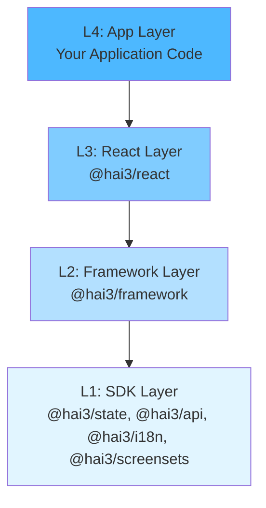

# HAI3 Architecture Overview

HAI3 (Human-AI Integrated Intelligence) is built on a carefully designed architecture that enables AI-assisted development while maintaining code quality, testability, and scalability.

## Core Architecture Principles

HAI3 is built on five fundamental principles:

1. **Event-Driven Everything**: Cross-domain communication only through events
2. **Open/Closed Principle**: Extend without modifying core code
3. **Dependency Discipline**: Strict layer dependencies (L1→L2→L3→L4)
4. **Type Safety**: No `any`, no `unknown`, no escape hatches
5. **Plugin Architecture**: Framework is a collection of plugins

These principles ensure maintainability, testability, and scalability as your application grows.

## The Four-Layer Architecture

HAI3 organizes all code into four distinct layers with unidirectional dependencies:



### L1: SDK Layer (Foundation)

**Packages:** `@hai3/state`, `@hai3/api`, `@hai3/i18n`, `@hai3/screensets`

The SDK layer provides core primitives with **zero cross-dependencies** and **no React**. These packages can be used independently in any JavaScript/TypeScript environment.

**Key Features:**
- Event bus for messaging
- Redux store with dynamic slice registration
- API client with protocol support (REST, SSE)
- Internationalization with lazy loading
- Screenset type definitions

**Why SDK Layer?**
- Testable in isolation (no React needed)
- Reusable across frameworks
- Clear, focused responsibilities
- No circular dependencies

[Learn more about SDK packages →](/hai3/architecture/sdk/state)

### L2: Framework Layer (Composition)

**Package:** `@hai3/framework`

The Framework layer composes SDK packages into a cohesive plugin-based framework.

**Key Features:**
- Plugin system and lifecycle management
- Registries (screensets, themes, API services, routes)
- Application builder (`createHAI3()`)
- Framework presets (full, minimal, headless)
- Plugin dependency resolution

**Example:**
```typescript
import { createHAI3 } from '@hai3/framework';
import { screensetPlugin } from '@hai3/framework/plugins';

const app = createHAI3()
  .use(screensetPlugin)
  .use(myCustomPlugin)
  .build();
```

[Learn more about Framework →](/hai3/architecture/framework)

### L3: React Layer (UI Bindings)

**Package:** `@hai3/react`

The React layer provides React bindings, hooks, and components. It depends **only** on `@hai3/framework`.

**Key Features:**
- `HAI3Provider` component
- React hooks (`useAppSelector`, `useAppDispatch`, `useTranslation`, `useNavigation`, `useTheme`, `useHAI3`)
- `AppRouter` component

**Example:**
```tsx
import { HAI3Provider, useAppSelector } from '@hai3/react';

function App() {
  return (
    <HAI3Provider app={hai3App}>
      <MyComponent />
    </HAI3Provider>
  );
}

function MyComponent() {
  const user = useAppSelector(state => state.user);
  return <div>Hello, {user.name}</div>;
}
```

[Learn more about React Layer →](/hai3/architecture/react)

### L4: App Layer (Your Code)

The App layer is where your application lives. This is your code, built on HAI3's foundation.

**Contains:**
- Screensets and screens
- Business logic
- Custom components
- API service implementations
- Application state slices
- Custom themes and styling

**Example Structure:**
```
src/
├── screensets/
│   ├── auth/
│   ├── dashboard/
│   └── settings/
├── services/
│   └── api/
├── themes/
└── App.tsx
```

[Learn more about App Layer →](/hai3/architecture/app)

## The Three Projections

HAI3's architecture can be viewed through three different "projections" or perspectives:

### Projection #I: Assets

Every HAI3 project includes three key assets:

**1. UI Core**
- Visual structure (menu, header, footer, sidebars, screen containers)
- Layout conventions and screen templates
- Microfrontend engine
- Customizable type system

**2. Prompts & Guidelines**
- Structured prompting system for AI code generation
- AI development guidelines (`.ai/` folder)
- Convention enforcement rules
- Quality gates for AI-generated code

**3. Build System**
- Flexible build pipeline (Web, Electron)
- Screen-set configuration
- Multi-repository support
- Mock API server generation

### Projection #II: Screen-Set Categories

HAI3 supports three screen-set categories representing development stages:

| Category | Purpose | Description |
|----------|---------|-------------|
| **Drafts** | AI-generated | Automatically created by AI from prompts and specs |
| **Mockups** | Semi-refined | Human designers refine drafts with visual details |
| **Production** | Finalized | Engineer-polished screens integrated into production |

**Screen-Set Switcher:** Toggle between categories in real-time for A/B testing and progressive refinement.

### Projection #III: UI Core Layers

The UI Core itself has three internal layers:

| Layer | Description |
|-------|-------------|
| **Presentation** | Component library (buttons, grids, forms, typography) + TailwindCSS styles |
| **Layout** | Visual structure (menu, header, footer, sidebar, popup system) |
| **Libraries** | Shared utilities (HTTP, events, plugins, microfrontend engine) |

These layers enable compositional UI development from modular parts.

## Package Structure

HAI3 is organized as a monorepo with the following packages:

```
packages/
├── state/           # L1: Event bus, Redux store
├── api/             # L1: API client, protocols
├── i18n/            # L1: Internationalization
├── screensets/      # L1: Screenset types
├── framework/       # L2: Plugin system, registries
├── react/           # L3: React bindings, hooks
├── uikit/           # L3: UI components (optional)
├── studio/          # L3: Development overlay (dev only)
└── cli/             # Dev tool: Project scaffolding
```

**Dependency Rules:**
- SDK packages (L1) have **zero** `@hai3/*` dependencies
- Framework (L2) depends only on SDK packages
- React (L3) depends only on `@hai3/framework`
- Your app (L4) depends on `@hai3/react` and chosen UI kit

## Design Patterns

### Event-Driven Communication

All cross-domain communication happens through the event bus:

```typescript
import { eventBus } from '@hai3/framework';
import { useEffect } from 'react';

// Emit an event
eventBus.emit('user.profile.updated', { userId: '123' });

// Listen to events
function ProfileListener() {
  useEffect(() => {
    const unsubscribe = eventBus.on('user.profile.updated', (payload) => {
      console.log('Profile updated:', payload);
    });
    return unsubscribe; // Cleanup on unmount
  }, []);

  return null;
}
```

**Benefits:**
- Decoupled components
- Testable interactions
- Clear data flow
- Microfrontend isolation

[Learn more about Event-Driven Architecture →](/hai3/concepts/event-driven)

### Plugin-Based Extensibility

HAI3 itself is built as a collection of plugins:

```typescript
import { createPlugin } from '@hai3/framework';

export const analyticsPlugin = createPlugin({
  id: 'analytics',
  name: 'Analytics Plugin',
  initialize: (app) => {
    app.eventBus.on('*', (event) => {
      trackEvent(event.type, event.payload);
    });
  }
});
```

**Benefits:**
- Extend without modifying core
- Isolated concerns
- Reusable across projects
- Easy to test

[Learn more about Plugin System →](/hai3/concepts/plugins)

### Registry Pattern

Registries implement the Open/Closed Principle:

```typescript
// Framework provides registries
const screensetRegistry = app.getRegistry('screensets');
const themeRegistry = app.getRegistry('themes');

// Your code extends them
screensetRegistry.register(myScreenset);
themeRegistry.register(myTheme);
```

**Built-in Registries:**
- Screenset Registry
- Theme Registry
- API Service Registry
- Route Registry

### Type Safety

HAI3 has strict TypeScript with no escape hatches:

```typescript
// ✅ Good: Fully typed
const user = useAppSelector((state: RootState) => state.user);

// ❌ Bad: No any allowed
const data = response as any; // ESLint error!

// ❌ Bad: No unknown in definitions
function process(value: unknown) {} // ESLint error!
```

## Architecture Validation

HAI3 includes automated architecture validation:

```bash
npm run arch:check        # Run all checks
npm run arch:deps         # Check circular dependencies
npm run arch:layers       # Validate layer dependencies
npm run arch:sdk          # Verify SDK isolation
npm run arch:unused       # Find unused exports
```

**Quality Gates:**
- ✅ No circular dependencies
- ✅ Layer dependencies enforced
- ✅ SDK packages truly isolated
- ✅ No `any` or `unknown` types
- ✅ Event-driven architecture compliance

## Why This Architecture?

### For Developers

**Testability:** Each layer can be tested in isolation. SDK packages don't need React, Framework doesn't need UI.

**Clarity:** Clear dependencies make codebases easier to understand and navigate.

**Reusability:** SDK packages work anywhere. Framework works with any UI library.

**Safety:** TypeScript + architecture checks prevent common mistakes.

### For AI Agents

**Clear Boundaries:** Agents know exactly where code belongs and what it can depend on.

**Validation:** Automatic checks catch violations before they reach production.

**Patterns:** Consistent patterns make AI-generated code more predictable.

**Guidelines:** `.ai/` folder provides clear rules for code generation.

### For Teams

**Scalability:** Architecture scales from solo developers to large teams.

**Isolation:** Teams can work on different layers without conflicts.

**Standards:** Enforced patterns reduce bikeshedding and inconsistency.

**Onboarding:** Clear structure helps new team members understand the codebase.

## Related Documentation

- [Layers in Detail](/hai3/architecture/layers)
- [Framework Layer](/hai3/architecture/framework)
- [React Layer](/hai3/architecture/react)
- [SDK Packages](/hai3/architecture/sdk/state)
- [Plugin System](/hai3/concepts/plugins)
- [Event-Driven Architecture](/hai3/concepts/event-driven)
- [Architecture Rules](/hai3/contributing/architecture-rules)
- [Manifest](/hai3/architecture/manifest)

## Next Steps

1. **Understand the Layers:** Read [Layers](/hai3/architecture/layers) for detailed layer responsibilities
2. **Learn Core Concepts:** Explore [Event-Driven Architecture](/hai3/concepts/event-driven) and [Plugins](/hai3/concepts/plugins)
3. **Build Something:** Follow [Creating Screensets](/hai3/guides/creating-screensets) to build your first feature
4. **Dive Deeper:** Check out [SDK packages](/hai3/architecture/sdk/state) for low-level details
